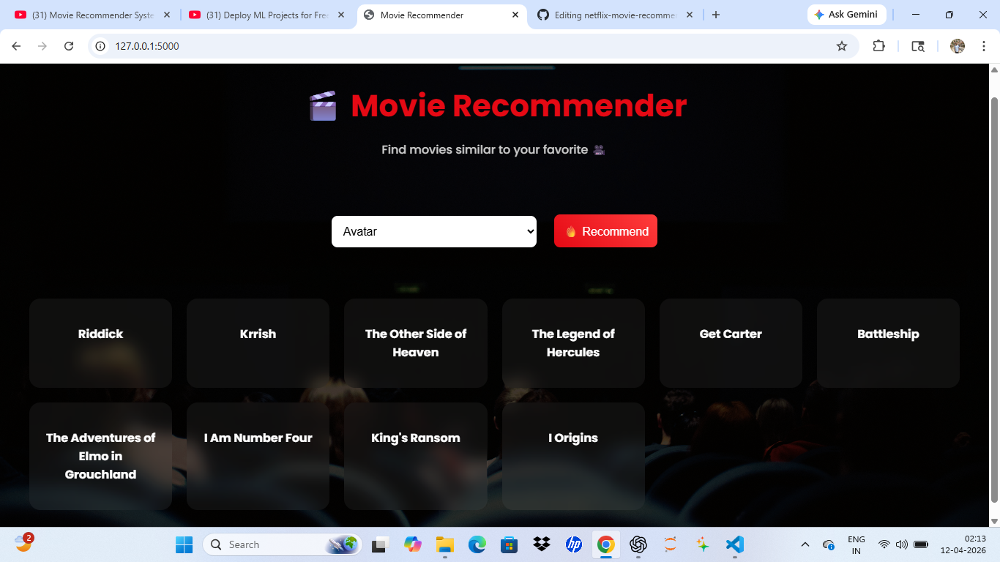

# 🎬 Netflix Movie Recommender System

A modern **Netflix-style Movie Recommender System** built using **Flask**.
It suggests similar movies based on user selection with a clean and interactive UI.

---

## 📸 Preview



---

## 🔥 Features

✨ Movie recommendation using similarity matrix
🎨 Netflix-inspired dark UI
⚡ Fast and lightweight (no API dependency)
📱 Responsive design
🧠 Content-based filtering

---

## 🛠️ Tech Stack

* Python 🐍
* Flask 🌐
* HTML, CSS 🎨
* Machine Learning 🤖

---

## 📂 Project Structure

```
movie-recommender/
│
├── app.py
├── movies.pkl
├── similarity.pkl   (not uploaded on GitHub)
├── requirements.txt
│
├── screenshot.png
│
└── templates/
    └── index.html
```

---

## ⚙️ How It Works

1. User selects a movie
2. System finds similar movies using cosine similarity
3. Top recommended movies are displayed

---

## 🚀 Run Locally

```bash
git clone https://github.com/YOUR_USERNAME/netflix-movie-recommender.git
cd netflix-movie-recommender

pip install -r requirements.txt
```

### ⚠️ Important

Download `similarity.pkl` manually and place it in the root folder.

```bash
python app.py
```

---

## 🌐 Future Improvements

🔍 Add search autocomplete
🎥 Add movie posters
☁️ Deploy on cloud (Render)
⭐ Improve recommendation accuracy

---

## 🙌 Author

**Yogesh Gupta**

---

## ⭐ Show your support

If you like this project, give it a ⭐ on GitHub!
